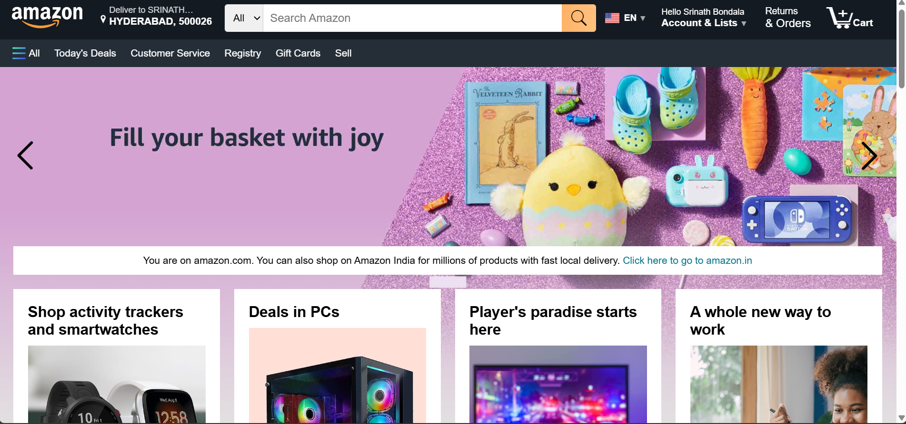
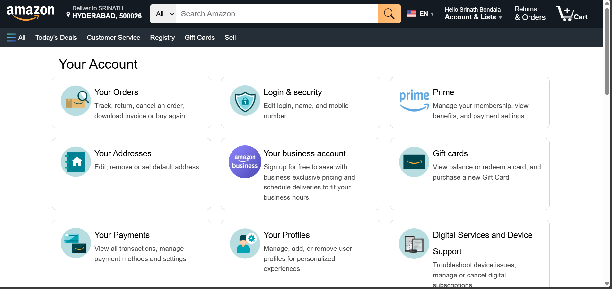
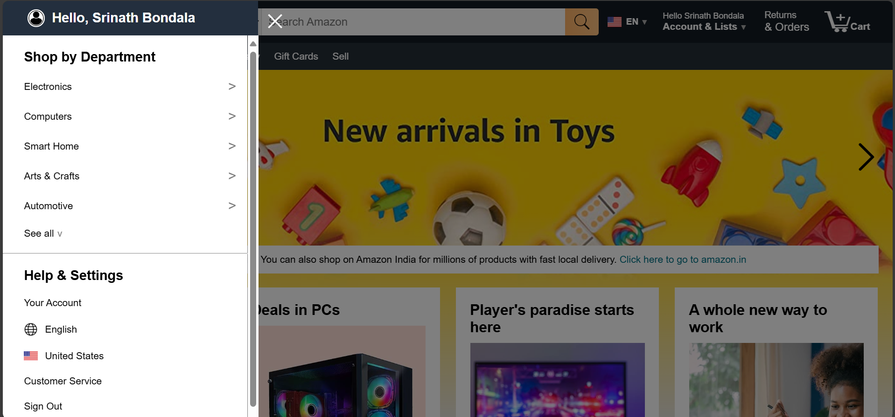
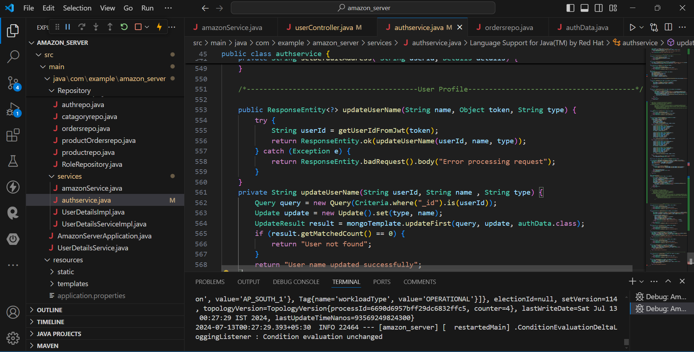
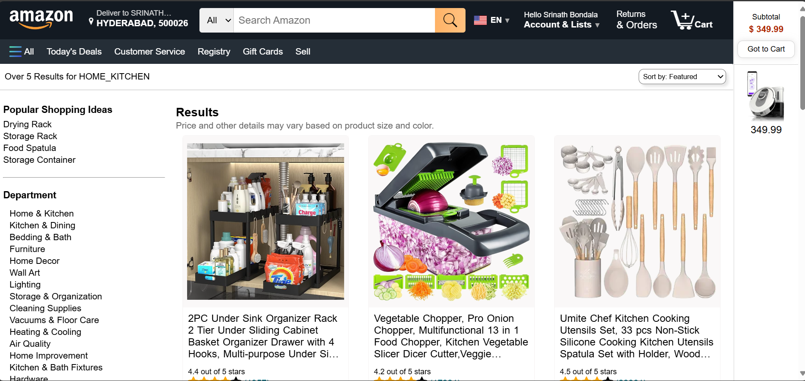
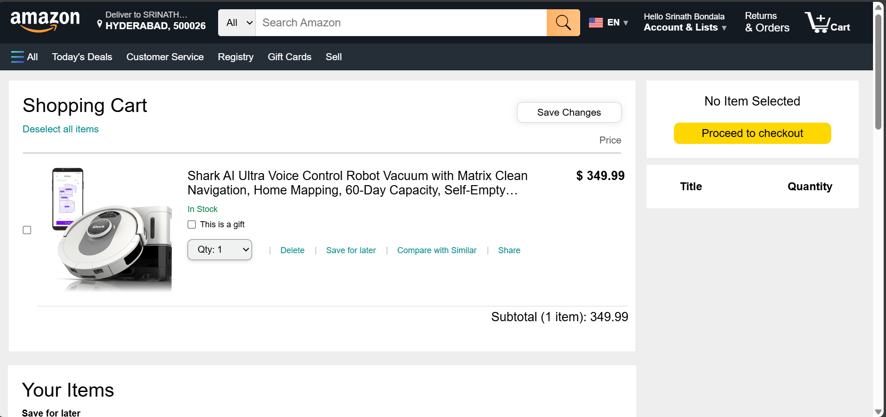

# Amazon Clone

Welcome to the Amazon Clone project! This is a simple e-commerce web application that mimics the core functionalities of Amazon. The frontend is built using HTML, CSS, and JavaScript, while the backend is implemented with Spring Boot and features JWT authentication.

## Features

- **User Authentication (JWT)**: Secure authentication mechanism using JSON Web Tokens.
- **Product Listing**: Displaying a catalog of products available for purchase.
- **Shopping Cart**: Ability to add/remove products to/from the cart.
- **Order Management**: Processing orders and maintaining order history.
- **User Profile Management**: Allowing users to manage their profiles.
- **Product Reviews**: Enabling users to leave reviews for products.
- **Payment Processing**: Integration with a payment gateway for secure transactions.

## Technologies

### Frontend

- **HTML**: Markup language for creating web pages.
- **CSS**: Styling language to design the presentation of HTML elements.
- **JavaScript**: Programming language for interactive web elements and AJAX calls.
- **AJAX**: Asynchronous JavaScript and XML for making asynchronous HTTP requests.

### Backend

- **Spring Boot**: Java-based framework for building enterprise-grade applications.
- **JWT (JSON Web Tokens)**: Secure method for transmitting information between parties.
- **Java**: Backend programming language.
- **Maven**: Dependency management tool for Java projects.
- **MongoDB**: NoSQL database for storing application data.

## Project Structure

### Frontend

The frontend consists of various HTML files that handle different aspects of the user experience, including user authentication, product display, shopping cart management, order processing, and more.

### Backend

The backend is developed using Spring Boot and includes JWT authentication for secure API calls. You can find the complete backend code in the following repository:

[Amazon Server Backend](https://github.com/srinathbondala/amazon_server)

## Getting Started

### Prerequisites

- Node.js and npm installed
- Java Development Kit (JDK) installed
- Maven installed

### Installation

1. **Clone the repository**

    ```bash
    git clone https://github.com/srinathbondala/amazon_clone
    cd amazon_clone
    ```

2. **Install frontend dependencies**

    ```bash
    npm install
    ```

3. **Run the frontend**

    ```bash
    npm start
    ```

4. **Clone and run the backend**

    Follow the instructions provided in the [Amazon Server Backend](https://github.com/srinathbondala/amazon_server) repository to set up and run the backend server.

### Usage

1. **Open the application**

    Navigate to `http://localhost:3000` in your browser to start using the Amazon Clone application.

2. **Sign Up and Sign In**

    Use the sign-up and sign-in pages to create a new account and sign in.

3. **Browse Products**

    Explore the products listed on the homepage and view details using the product details page.

4. **Manage Cart and Orders**

    Add products to your cart, proceed to checkout, and manage your orders.

5. **Profile Management**

    View and update your profile information on the profile page.

## AJAX Calls

The application uses AJAX calls to interact with the backend services. These calls handle user authentication, product fetching, cart management, and order processing, ensuring a dynamic and responsive user experience.

# Project Demo Images

Here are some screenshots of our Amazon replica project:








## Contributing

Feel free to fork this repository and submit pull requests. For major changes, please open an issue first to discuss what you would like to change.

## Contact

If you have any questions or suggestions, feel free to reach out.

Happy coding
